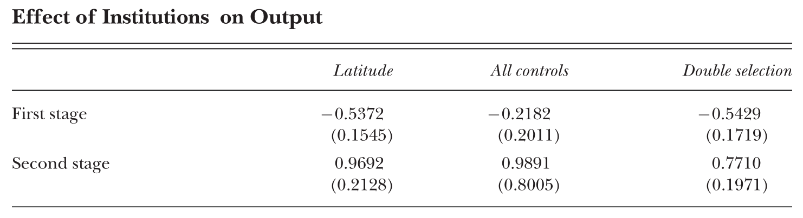
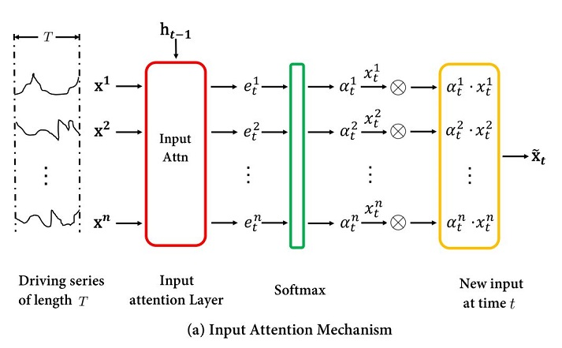
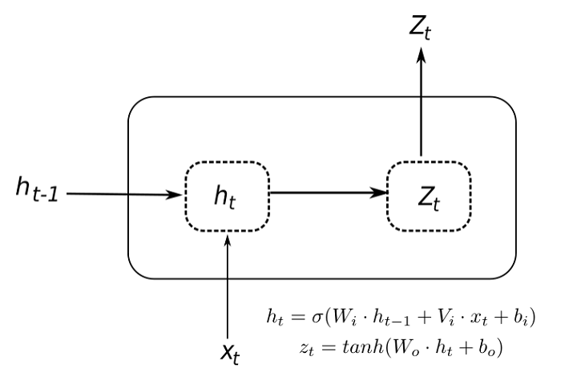
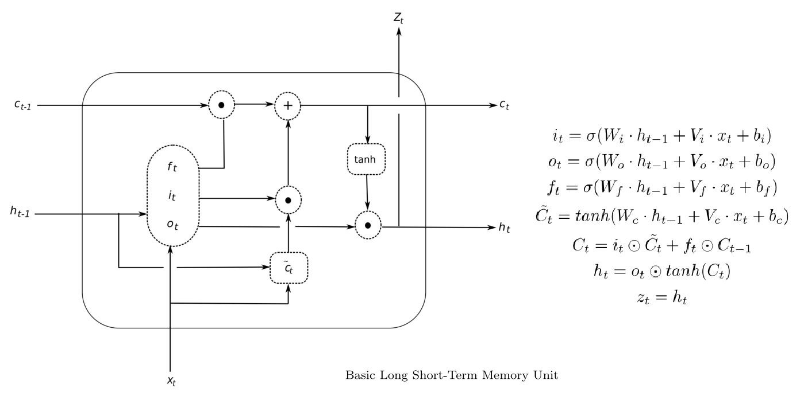
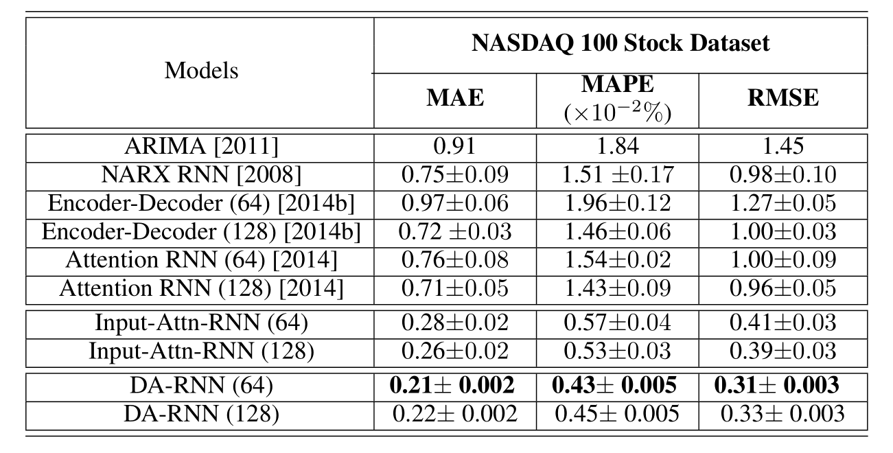
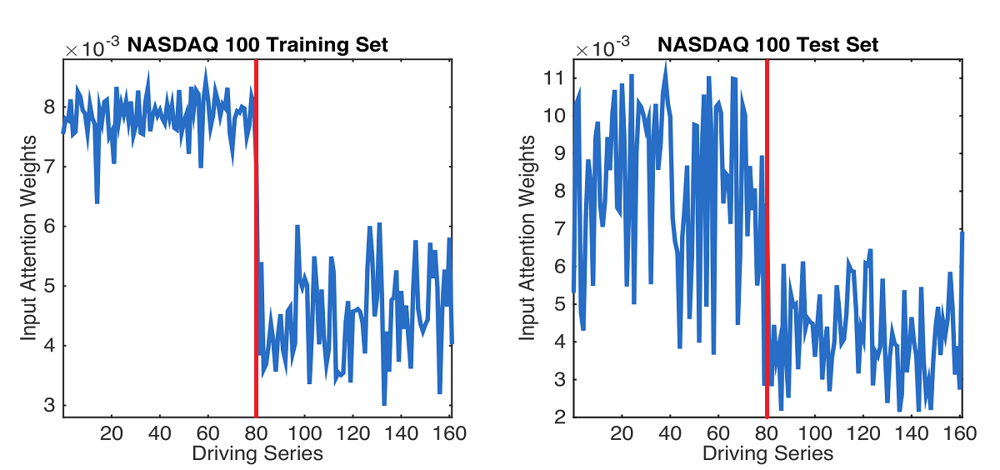

class: animated, fadeIn
## Outline

- References

- Motivation 1 + Paper 1

- Motivation 2 + Paper 2

---
class: animated, fadeIn
## References

- Hansen, Bruce E. (ver 2021, forthcoming) **Econometrics.** *Princeton University Press*

- Belloni, A., Chernozhukov, V., & Hansen, C. (2014). **High-dimensional methods and inference on structural and treatment effects.** *Journal of Economic Perspectives*, 28(2), 29-50

--

- Hewamalage, H., Bergmeir, C., & Bandara, K. (2021). **Recurrent neural networks for time series forecasting: Current status and future directions.** *International Journal of Forecasting*, 37(1), 388-427

- Qin, Y., Song, D., Chen, H., Cheng, W., Jiang, G., & Cottrell, G. (2017). **A dual-stage attention-based recurrent neural network for time series prediction.** *arXiv preprint arXiv:1704.02971*

---
class: section, animated, fadeIn
## Why do we often think that 
# ML is a black box?

---
class: animated, fadeIn
## Hansen's Econometrics, Chapter 29 "Machine Learning"

### ML is ...

- used to describe a set of algorithmic approaches to statistical learning

- primarily focused on point prediction in settings with unknown structure

- (for econometrics) thought of as *"highly nonparametric"*

--

### ML analysis may allow for hundreds or even thousands of regressors ..., and does not require prior information about which regressors are most relevant

---
class: animated, fadeIn
## Hansen's Econometrics, Chapter 29 "Machine Learning"

- The early literature was algorithmic with no associated statistical theory

--

- Followed by a statistical literature examining the properties of machine learning methods

--

- Only recently has the literature expanded to include inference

---
class: section, animated, fadeIn
## Belloni, A., Chernozhukov, V., & Hansen, C. (2014)

# High-dimensional methods and inference on structural and treatment effects

## *Journal of Economic Perspectives*, 28(2), 29-50

---
class: animated, fadeIn
## High-dimensional data phenomenum

- many different characteristics per observation are available

- researchers rarely know the exact functional form, and are faced with a large set
of potential interacted and transformed variables

---
class: animated, fadeIn
## Prediction *vs* Explanation

- many statistical methods are available for constructing prediction models in the presence of high-dimensional data

- they tend to do a good job at prediction, but they can often lead to incorrect conclusions when inference about parameters is the object of interest

--

- Belloni et al. (2014) show how "data mining" can be adapted and modified to provide high-quality inference about model parameters

--

- "data mining" means a principled search for **"true predictive power"**:

  - guards against false discovery and overfitting,
  
  - does not equate in-sample fit to out-of-sample predictive ability,
  
  - and **accurately accounts for using the same data to examine many different hypotheses or models**.

---
class: animated, fadeIn
## Using LASSO

-  useful for

  - obtaining forecasting rules 
  
  - estimating which variables have a strong association to an outcome

--

- naively using the results obtained from such a procedure to draw inferences about
model parameters can be problematic

---
class: animated, fadeIn
## Model Selection When the Goal is Causal Inference

- whatever model selection is not perfect

- model selection mistakes lead to omitted variables

- inference procedures that are robust to such mistakes are needed

  

--

### Two Scenarios

- Inference with Selection among Many Instruments

- Inference with Selection among Many Controls

---
class: animated, fadeIn
## Inference with Selection among Many Controls

$$y_i=\alpha d_i+x_i'\theta_y+r_{yi}+\zeta_i,\tag{1}$$

$$\mathbb{E}[\zeta_i|d_i,x_i,r_{yi}]=0,$$

- $d_i$ is treatment variable (exogenous after controlling on $x$)

- $\alpha$ is the parameter of interest

- $x_i$ is $p$-dim., and $p>>n$ is allowed

- $r_{yi}$ is approximation error

---
class: animated, fadeIn
## A naive (and incorrect!) approach

**Applying LASSO to eq. (1) would be wrong**

- $\alpha$ will not be in the penalty, as $d$ must remain the the eq.

- LASSO focuses prediction and removes $x$s highly correlated to $d$

- results in omitted-variables bias

--

### The key problems are

- ignoring the relationship between $d$ and $x$

- the initial model is "structural", not predictive

--

**Solution**: apply selection to two predictive relationships: $y|d,x$ and $d|x$.

---
class: animated, fadeIn
## Double Selection Approach

$$d_i=x_i'\theta_d+r_{di}+v_i,$$

$$y_i = x_i'(\alpha\theta_d+\theta_y)+(\alpha r_{di}+r_{yi})+(\alpha v_i+\zeta_i)=x_i'\pi+r_{ci}+\varepsilon_i,$$
$$\mathbb{E}[v_i|x_i,r_{di}]=\mathbb{E}[\varepsilon_i|x_i,r_{ci}]=0$$

- $r_{ci}$ is a composite approximation error

 

--

- LASSO is applied to both equations, giving $x_{di}$, $x_{yi}$

- $\alpha$ is estimated by OLS of $y_i$ on the union of $x_{di}$  and $x_{yi}$

---
class: animated, fadeIn
## Some Empirical Examples

- Estimating the Impact of Eminent Domain on House Prices

  

- Estimating the Effect of Legalized Abortion on Crime

  

- Estimating the Effect of Institutions on Output

--

Acemoglu, Daron, Simon Johnson, and James A. Robinson. (2001). The Colonial Origins of Comparative Development: An Empirical Investigation. *American Economic Review*, 91(5), 1369-1401

---
class: ceneter, middle, animated, fadeIn
 
.right[Belloni et al. (2014), *Table 2*]

---
class: section, animated, fadeIn
# Part II

 

### a few words about

# Recurrent Neural Networks

---
class: animated, fadeIn
## A very brief introduction

Hewamalage, H., Bergmeir, C., & Bandara, K. (2021). **Recurrent neural networks for time series forecasting: Current status and future directions.** *International Journal of Forecasting*, 37(1), 388-427

- Comparisons against ETS and ARIMA demonstrate that the implemented (semi-)automatic
RNN models are no silver bullets, but they are competitive alternatives in many situations.

---
class: animated, fadeIn
## What is "wrong" with NNs?

- at some point NNs were not considered competitive

- enthusiasts were presenting many complex NN architectures, often without convincing empirical evaluations against simpler benchmarks

- among other issues, NNs are criticized for their black-box nature 

--

### Then "Big Data" happened

- Big Data for time series typically means that there are many related time series from the same domain

- univariate forecasting of an individual time series in isolation may fail to produce reliable forecasts

- NNs benefit from the availability of massive amounts of data

---
class: animated, fadeIn
## What is "black box" about NNs?

- often the "black box" arises not from poor interpretation, but from inability to reproduce

- simple univariate techniques are easy to use and "automatic"

- many users of traditional univariate techniques do not have the expertise to develop
and adapt complex NNs

---
class: center, middle, animated, fadeIn

---
class: center, middle, animated, bounceIn

---
class: center, middle, animated, fadeIn

.right[Hewamalage et al. (2021), *Figure 1*]

---
class: center, middle, animated, fadeIn

.right[Hewamalage et al. (2021), *Figure 2*]

---
class: animated, fadeIn
## Role of attention

Qin, Y., Song, D., Chen, H., Cheng, W., Jiang, G., & Cottrell, G. (2017). **A dual-stage attention-based recurrent neural network for time series prediction.** *arXiv preprint arXiv:1704.02971*

- most of non-linear approaches employ a predefined nonlinear form and may not be able to capture the true underlying nonlinear relationship

- RNNs are flexible in capturing nonlinearity

- RNNs suffer from the problem of vanishing gradients and have difficulty capturing long-term dependencies

- RNNs variations LSTM and GRU have overcome this limitation and achieved success in various applications

- it is natural to consider state-of-the-art RNN methods for time series prediction (encoder-decoder networks and attention based encoder-decoder networks)

---
class: animated, fadeIn
## Role of attention

Qin, Y., Song, D., Chen, H., Cheng, W., Jiang, G., & Cottrell, G. (2017). **A dual-stage attention-based recurrent neural network for time series prediction.** *arXiv preprint arXiv:1704.02971*

- encoder-decoder networks were successful in machine translation

- a problem with encoder-decoder is that the performance deteriorates rapidly as the length of input sequence increases

- in time series analysis this is a concern when we aim to predict based upon a long segment of the series

- attention-based encoder-decoder network solves this selecting relevant parts of hidden states across time

- for time series prediction, they need to be modified

---
class: center, middle, animated, fadeIn

---
class: animated, fadeIn
## Empirical Example

- SML 2010 dataset

- NASDAQ 100 Stock dataset

---
class: animated, fadeIn
## Empirical Example

- NASDAQ 100 Stock dataset

  - the index value NASDAQ-100 is the target series

  - the stock prices of 81 major components are the predictors
  
  - 1m frequency
  
  - 105 days (July 26, 2016 to December 22, 2016)
  
  - 35100 data points for training, 2730 for validation, 2730 for testing

---
class: center, middle, animated, fadeIn

.right[Qin et al. (2017), *Table 2 (partially)*]

---
class: center, middle, animated, fadeIn

.right[Qin et al. (2017), *Figure 3*]

---
class: section, animated, zoomIn

### Instead of Conclusion

The DA-RNN is available in Julia or Python

https://sdobber.github.io/FA_DARNN/

https://opensourcelibs.com/lib/da-rnn

 

# Thank you!

